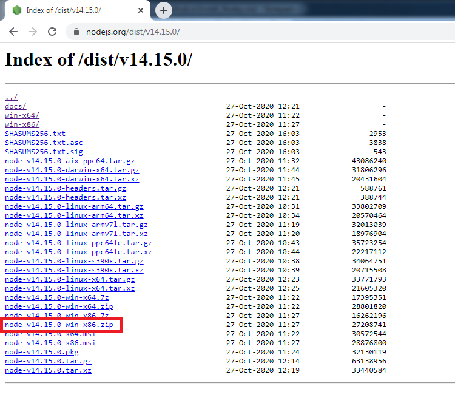
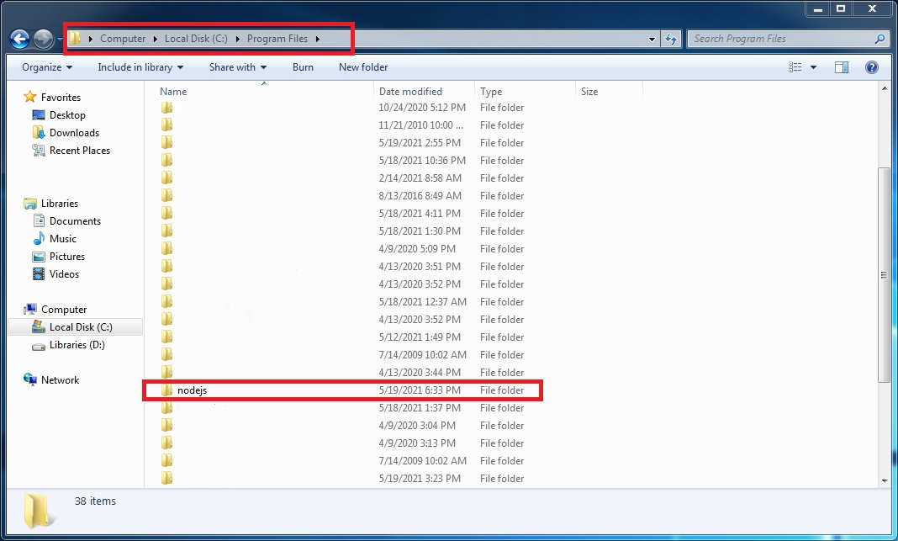
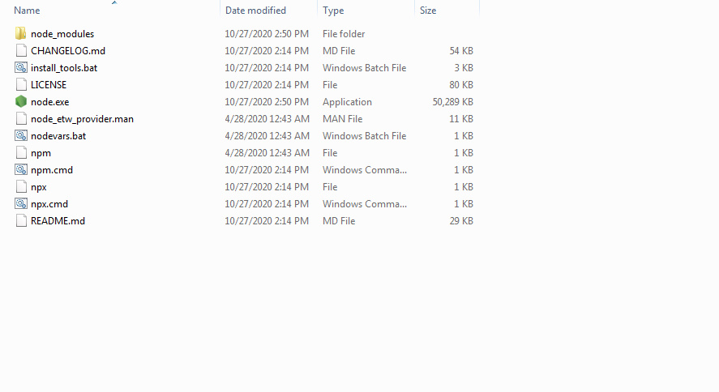

<h1 align="center">نصب نود جی اس  در ویندوز 7</h1>

1. ***مرحله اول*** :

طبق عکس زیر به [این سایت](https://nodejs.org/dist/v14.15.0/) مراجعه کنید و فایل مورد نظر را دانلود کنید.

  
# 
  

2. ***مرحله دوم*** :

طبق عکس زیر به همین آدرس در کامپیوتر خود مراجعه کنید و یه پوشه جدید با نام `nodejs` بسازید .

# 

</dir>

<dir dir="rtl">

  ======
  
- سپس فایلی را که دانلود کردید را در این پوشه استخراج کنید .

- فایل های که استخراج کردید در آخر باید به این شکل باشد .

</dir>

# 

</dir>

